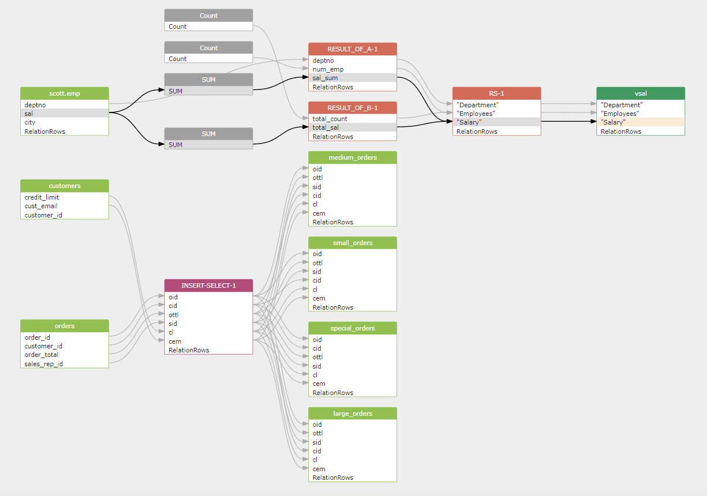
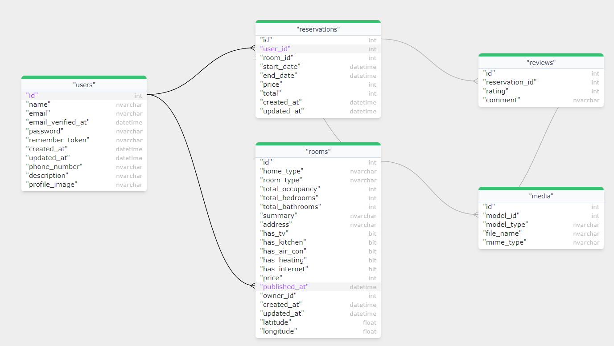

## Gudu SQLFlow Lite version for python

[Gudu SQLFlow](https://sqlflow.gudusoft.com)  is a tool used to analyze SQL statements and stored procedures 
of various databases to obtain complex [data lineage](https://en.wikipedia.org/wiki/Data_lineage) relationships and visualize them.

[Gudu SQLFlow Lite version for python](https://github.com/sqlparser/python_data_lineage) allows Python developers to quickly integrate data lineage analysis and 
visualization capabilities into their own Python applications. It can also be used in daily work by data scientists to quickly discover 
data lineage from complex SQL scripts that usually used in ETL jobs do the data transform in a huge data platform. 

Gudu SQLFlow Lite version for python is free for non-commercial use and can handle any complex SQL statements 
with a length of up to 10k, including support for stored procedures. It supports SQL dialect from more than 
20 major database vendors such as Oracle, DB2, Snowflake, Redshift, Postgres and so on.

Gudu SQLFlow Lite version for python includes [a Java library](https://www.gudusoft.com/sqlflow-java-library-2/) for analyzing complex SQL statements and 
stored procedures to retrieve data lineage relationships, [a Python file](https://github.com/sqlparser/python_data_lineage/blob/main/dlineage.py) that utilizes jpype to call the APIs 
in the Java library, and [a JavaScript library](https://docs.gudusoft.com/4.-sqlflow-widget/get-started) for visualizing data lineage relationships.

Gudu SQLFlow Lite version for python can also automatically extract table and column constraints, 
as well as relationships between tables and fields, from [DDL scripts exported from the database](https://docs.gudusoft.com/6.-sqlflow-ingester/introduction)
and generate an ER Diagram.

### Automatically visualize data lineage

By executing this command:
```
python dlineage.py /t oracle /f test.sql /graph
```

We can automatically obtain the data lineage relationships contained in the following Oracle SQL statement.
```sql
CREATE VIEW vsal 
AS 
  SELECT a.deptno                  "Department", 
         a.num_emp / b.total_count "Employees", 
         a.sal_sum / b.total_sal   "Salary" 
  FROM   (SELECT deptno, 
                 Count()  num_emp, 
                 SUM(sal) sal_sum 
          FROM   scott.emp 
          WHERE  city = 'NYC' 
          GROUP  BY deptno) a, 
         (SELECT Count()  total_count, 
                 SUM(sal) total_sal 
          FROM   scott.emp 
          WHERE  city = 'NYC') b 
;

INSERT ALL
	WHEN ottl < 100000 THEN
		INTO small_orders
			VALUES(oid, ottl, sid, cid)
	WHEN ottl > 100000 and ottl < 200000 THEN
		INTO medium_orders
			VALUES(oid, ottl, sid, cid)
	WHEN ottl > 200000 THEN
		into large_orders
			VALUES(oid, ottl, sid, cid)
	WHEN ottl > 290000 THEN
		INTO special_orders
SELECT o.order_id oid, o.customer_id cid, o.order_total ottl,
o.sales_rep_id sid, c.credit_limit cl, c.cust_email cem
FROM orders o, customers c
WHERE o.customer_id = c.customer_id;
```

And visualize it as:


### Oracle PL/SQL Data Lineage 
```
python dlineage.py /t oracle /f samlples/oracle_plsql.sql /graph
```


The [source code of this sample Oracle PL/SQL](samples/oracle_plsql.sql).

### Able to analyze dynamic SQL to get data lineage (Postgres stored procedure)
```sql
CREATE OR REPLACE FUNCTION t.mergemodel(_modelid integer)
RETURNS void
LANGUAGE plpgsql
AS $function$
BEGIN
    EXECUTE format ('INSERT INTO InSelections
                                  SELECT * FROM AddInSelections_%s', modelid);
                  
END;
$function$
```


  
### Nested CTE with star columns (Snowflake SQL sample)
```
python dlineage.py /t snowflake /f samlples/snowflake_nested_cte.sql /graph
```


The [snowflake SQL source code of this sample](samples/snowflake_nested_cte.sql).  

### Analyze DDL and automatically draw an ER Diagram.

By executing this command:
```
python dlineage.py /t sqlserver /f samples/sqlserver_er.sql /graph /er
```

We can automatically obtain the ER Diagram of the following SQL Server database:



The [DDL script of the above ER diagram is here](samples/sqlserver_er.sql).

## Try your own SQL scripts

You may try more SQL scripts in your own computer without any internet connection by cloning [this python data lineage repo](https://github.com/sqlparser/python_data_lineage)
```shell
git clone https://github.com/sqlparser/python_data_lineage.git
```

- No database connection is needed.
- No internet connection is needed.

You only need a JDK and a python interpreter to run the Gudu SQLFlow lite version for python. 

### step 1 Prerequisites
  * Install python3
  * Install Java jdk1.8

### step 2 Open the web server
 Switch to the widget directory of this project and execute the following command to start the web service:

 `python -m http.server 8000`
  
  Open the following URL in a web browser to verify if the startup was successful：http://localhost:8000/
  
  Note: If you want to modify the port 8000, you need to modify the widget_server_url in dlineage.py accordingly.

### step 3 Execute the python script
  Open a new command window, switch to the root directory of this project, where the dlineage.py file is located, and execute the following command:

  `python dlineage.py /t oracle /f test.sql /graph`
   
   This command will perform data lineage analysis on test.sql and open a web browser page to display the results of the analysis in a graphical result.
   
   Explanations of the command-line parameters supported by dlineage.py:

      /f: 可选, sql文件.

      /d: 可选, 包含sql文件的文件夹路径.

      /j: 可选, 返回包含join关系的结果.

      /s: 可选, 简单输出，忽略中间结果.

      /topselectlist: 可选, 简单输出，包含最顶端的输出结果.

      /withTemporaryTable: 可选, 简单输出，包含临时表.

      /i: 可选, 与/s选项相同，但将保留SQL函数生成的结果集，此参数将与/s/topselectlist+keep SQL函数生成结果集具有相同的效果。

      /showResultSetTypes: 可选, 带有指定结果集类型的简单输出，用逗号分隔, 结果集类型有： array, struct, result_of, cte, insert_select, update_select, merge_update, merge_insert, output, update_set pivot_table, unpivot_table, alias, rs, function, case_when

      /if: 可选, 保留所有中间结果集，但删除 SQL 函数生成的结果集。

      /ic: 可选, 忽略输出中的坐标.

      /lof: 必选, 将孤立列链接到第一个表.

      /traceView: 可选,只输出源表和视图的名称，忽略所有中间数据.

      /text: 可选, 如果只使用/s 选项，则在文本模式下输出列依赖项.

      /json: 可选, 打印json格式输出.

      /tableLineage [/csv /delimiter]: 可选, 输出表级血缘关系.

      /csv: 可选, 输出csv格式的列一级的血缘关系.

      /delimiter: 可选, 输出csv格式的分隔符.

      /t: 必选, 指定数据库类型. 
        支持 access,bigquery,couchbase,dax,db2,greenplum, gaussdb, hana,hive,impala,informix,mdx,mssql,
        sqlserver,mysql,netezza,odbc,openedge,oracle,postgresql,postgres,redshift,snowflake,
        sybase,teradata,soql,vertica the default value is oracle

      /env: 可选, 指定一个 metadata.json 来获取数据库元数据信息.

      /transform: 可选, 输出关系转换码.

      /coor: 可选, 输出关系转换坐标，但不输出代码.

      /defaultDatabase: 可选, 指定默认database.

      /defaultSchema: 可选, 指定默认schema.

      /showImplicitSchema: 可选, 显示间接schema.

      /showConstant: 可选, 显示常量.

      /treatArgumentsInCountFunctionAsDirectDataflow: 可选,将 count 函数中的参数视为直接数据流.

      /filterRelationTypes: 可选, 过滤关系类型，支持 fdd，fdr，join，call，er，如果有多个关系类型用英文半角逗号分隔.

      /graph: 可选, 打开一个浏览器页面，图形化方式展示血缘分析结果
      /er: 可选, 打开一个浏览器页面，图形化方式展示ER图
	  
	  
### Export metadata from various databases.
You can export metadata from the database using [SQLFlow ingester](https://github.com/sqlparser/sqlflow_public/releases) 
and hand it over to Gudu SQLFlow for data lineage analysis.。

[Document of the SQLFlow ingester](https://docs.gudusoft.com/6.-sqlflow-ingester/introduction)